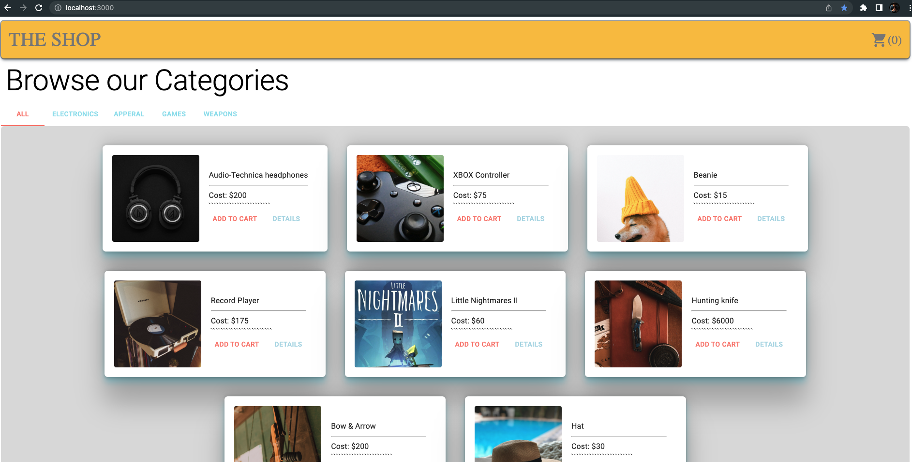

# Lab - 37

## Phase 3 Requirements

In phase 3, we will be connecting our Virtual Store to a live API so that our data is persistent and able to be separately managed.

The user stories from Phases 1 and 2 remain unchanged. For this phase, we are now adding the following new user stories to meet the new requirements.

- As a user, I want to interact with live inventory so that I have confidence that the displayed products are in stock

- As a user, I want to know to that when I add an item to my cart, that it is removed from inventory so that no other users can purchase it

## StoreFront

Author: Danny Castro

- tests report
- front-end
- back-end (https://storefront-server.herokuapp.com)

retruns:

### Setup

`.env` requirements (Heroku)

- PORT = 3080

### Running the app:

- npm start

- Endpoint: http://localhost:3000/

Returns:

### Collaborators

- Tony Regalado
