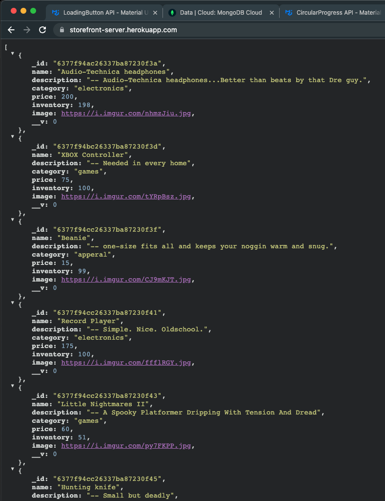

# Lab - 39

## Phase 4 Requirements

In phase 4, we will be completing work on our Virtual Store by adding a two full page views to the application: Product Details and Checkout

The user stories from Phases 1, 2 and 3 remain unchanged. For this phase, we are now adding the following new user stories to meet the new requirements.

- As a user, I want to see a full detail view of a product so that I can make a more informed choice about purchasing it.

- As a user, I want to view my full cart and initiate the checkout process so that I can purchase my items and have them delivered

## StoreFront

Author: Danny Castro

### App site

- [front-end](https://main--dannys-storefront.netlify.app/)
- [back-end](https://storefront-server.herokuapp.com)

retruns:

- frontend:
  
- backend:
  

### Setup

`.env` requirements (Heroku)

- PORT = 3080

### Running the app:

- npm start

- Endpoint: http://localhost:3000/

Returns:

### Collaborators

- Tony Regalado
